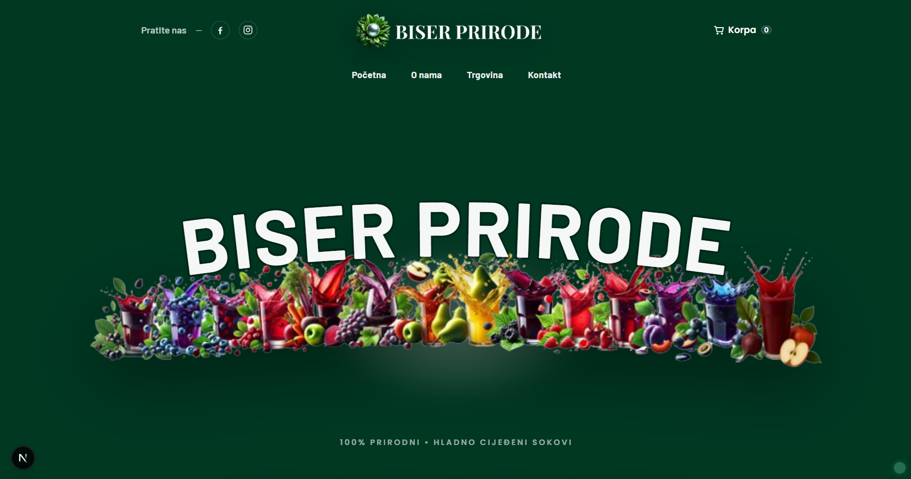
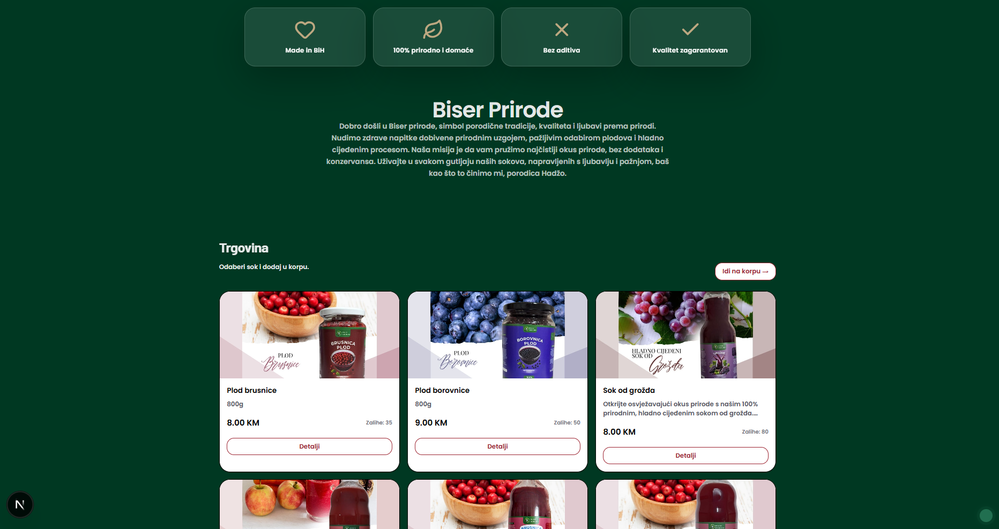
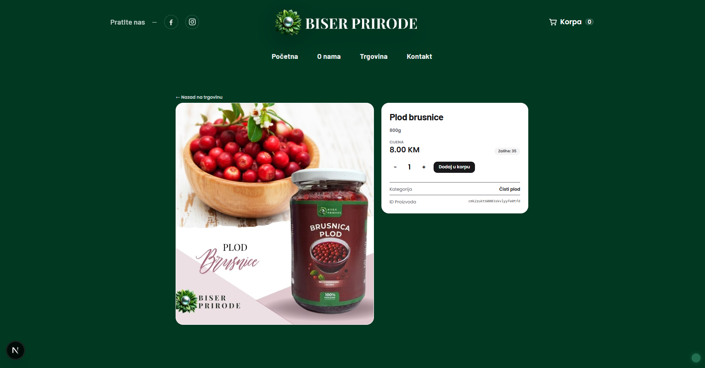
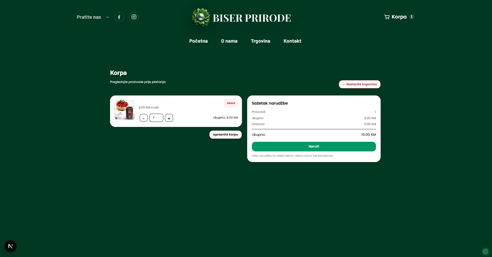
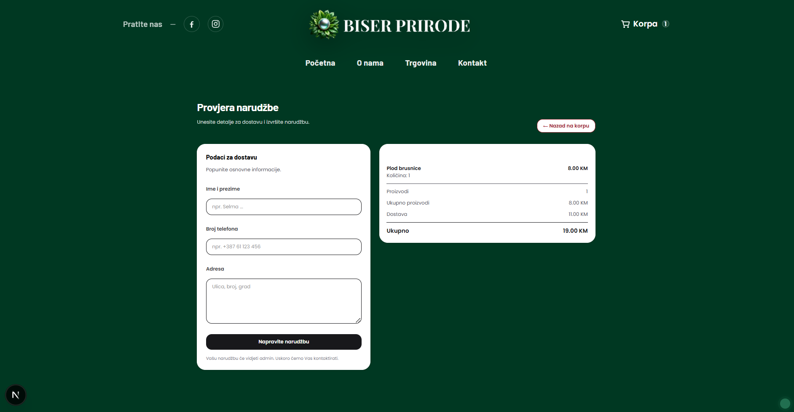
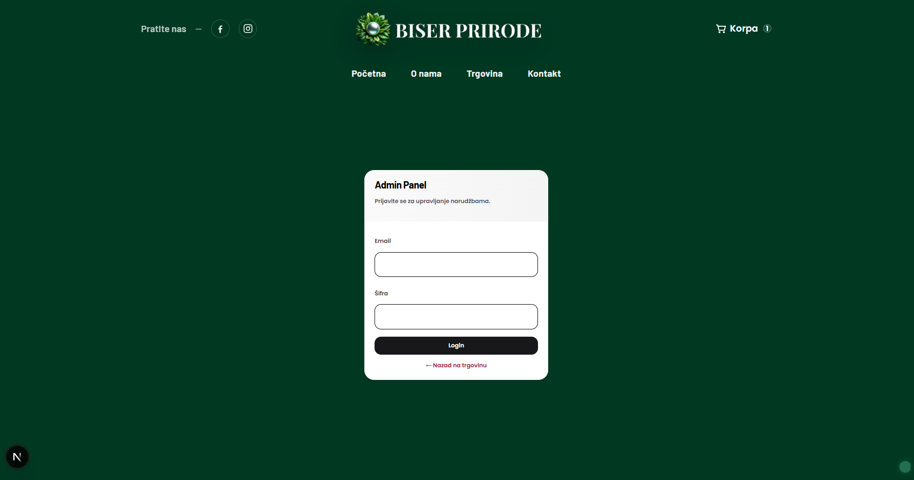
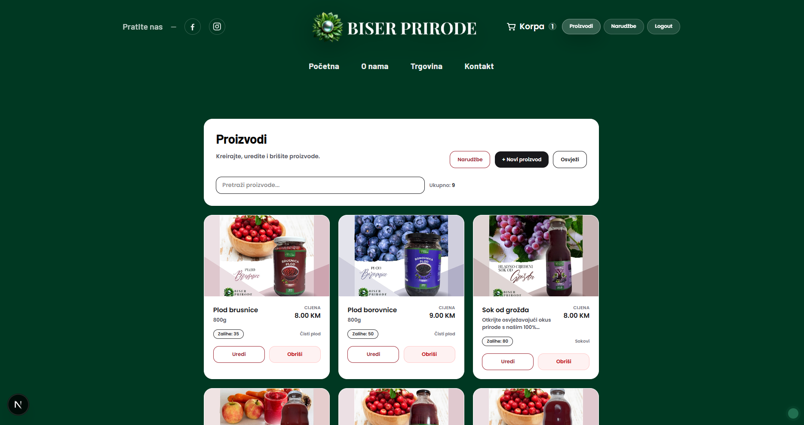
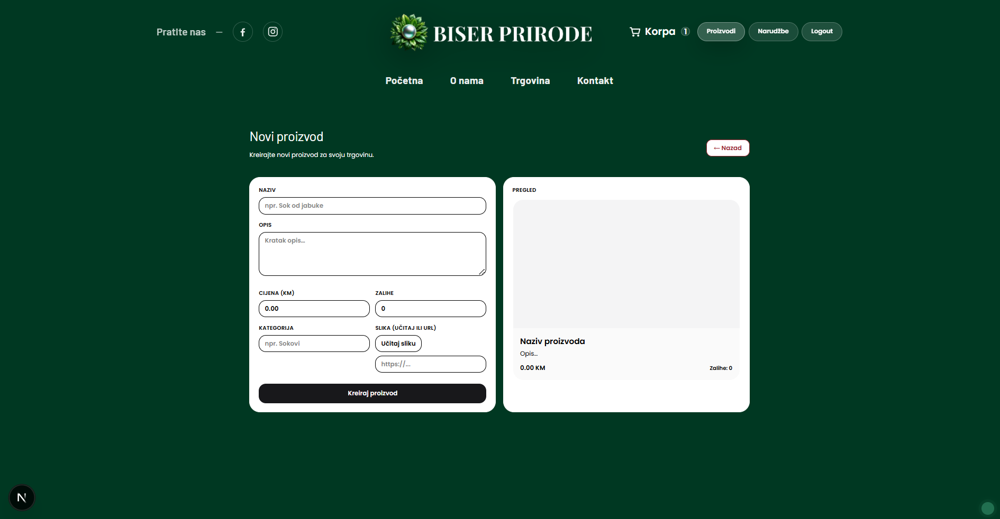
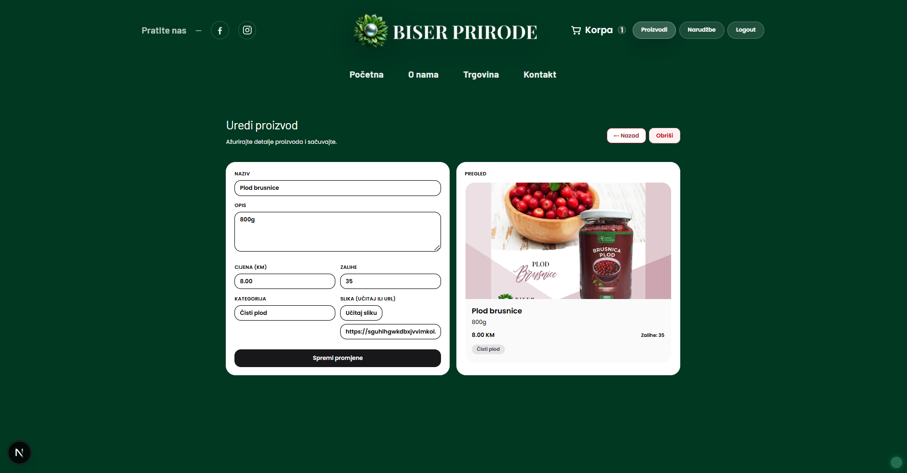
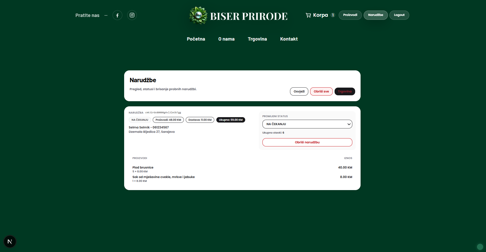

# Biser Prirode Shop

Full-stack web shop aplikacija za **Biser Prirode** (prirodni proizvodi) sa korisničkim dijelom (shop) i admin panelom.

---

## Features

### Shop (User)
- Landing stranice / pregled ponude
- Detalji proizvoda
- Korpa (cart) i pregled stavki
- Kreiranje narudžbe / detalji narudžbe

### Admin
- Admin login
- Upravljanje proizvodima (pregled, dodavanje, uređivanje)
- Pregled narudžbi

---

## Tech Stack

- **Frontend:** React (u folderu `/frontend`) :contentReference[oaicite:1]{index=1}  
- **Backend:** Node.js API (u folderu `/backend`) :contentReference[oaicite:2]{index=2}  
- **Database / ORM:** PostgreSQL + Prisma (migracije) :contentReference[oaicite:3]{index=3}  

> Napomena: tačni detalji (npr. auth mehanizam, hosting, payment) zavise od tvoje implementacije — slobodno dopuni ako želiš.

---

## Setup / Run locally

### Backend
```bash
cd backend
npm install
cp .env.example .env
npx prisma migrate dev
npm run dev

### Frontend
cd frontend
npm install
cp .env.example .env.local
npm run dev

## Screenshots

<p>
  
  
</p>

<p>
  
  
</p>

<p>
  
  
</p>

<p>
  
  
</p>

<p>
  
  
</p>
